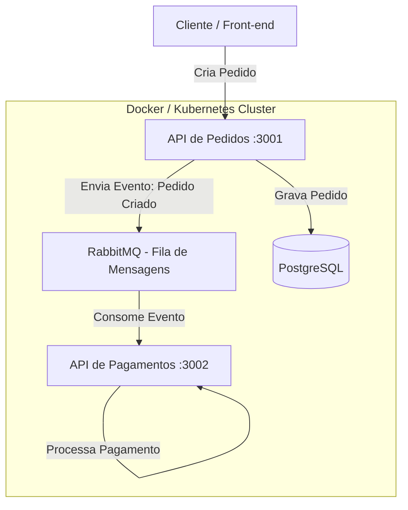

<div align="center">
  
  <h1>🛒 Loja Veloz - Microsserviços e DevOps</h1>
  
  <p>
    <strong>Plataforma de E-commerce conteinerizada e orquestrada para alta disponibilidade.</strong>
  </p>

  <!-- Badges -->
  <p>
    
    
    
    
    
    
  </p>
</div>

<br/>

## 🎬 Demonstração do Projeto

[](https://youtu.be/dfpseP9zb3o)

> 💡 **Dica:** Clique na imagem acima para assistir ao vídeo explicativo sobre o funcionamento e arquitetura do projeto no YouTube.

---

## 📖 Sobre o Projeto

O **Loja Veloz** é uma aplicação moderna baseada em arquitetura de microsserviços. O sistema foi desenvolvido para lidar com cenários de compras online de forma resiliente e escalável. 

A arquitetura utiliza o **Docker** para conteinerização de serviços como:
- **Pedidos (Porta 3001)**: Microsserviço em Node.js responsável pelo gerenciamento de pedidos de clientes e conexão com o banco de dados.
- **Pagamentos (Porta 3002)**: Microsserviço em Node.js focado no processamento de transações financeiras.
- **PostgreSQL**: Banco de dados relacional para persistência de dados consistentes.
- **RabbitMQ**: Message Broker (Mensageria) garantindo a comunicação assíncrona entre os microsserviços de Pedidos e Pagamentos.

Tudo isso suportado por fluxos de CI/CD via **GitHub Actions** e preparado para orquestração em nuvem com **Kubernetes**.

---

## 🏗️ Arquitetura



---

## 🚀 Como Executar Localmente

### Pré-requisitos
- [Docker](https://www.docker.com/) e [Docker Compose](https://docs.docker.com/compose/) instalados na sua máquina.

### Passo a Passo

1. **Clone o repositório**
   ```bash
   git clone https://github.com/seu-usuario/loja-veloz.git
   cd loja-veloz
   ```

2. **Inicie os serviços com Docker Compose**
   ```bash
   docker-compose up -d --build
   ```

3. **Verifique os logs (Opcional)**
   ```bash
   docker-compose logs -f
   ```

4. **Testando as APIs**
   - **Pedidos:** Acesse `http://localhost:3001`
   - **Pagamentos:** Acesse `http://localhost:3002`
   - **RabbitMQ Dashboard:** Acesse `http://localhost:15672` (Usuário/Senha padrão do RabbitMQ)

---

## ⚙️ CI/CD e Kubernetes (DevOps)

Este repositório está configurado com as melhores práticas de DevOps:

- **CI/CD Pipeline (`.github/workflows/ci-cd.yml`)**: Realiza testes, linting, build automatizado das imagens Docker dos microsserviços e pode publicá-las em um Container Registry (ex: Docker Hub).
- **Manifestos K8s (`/k8s`)**: Contém os arquivos de Deployments, Services, ConfigMaps e Secrets necessários para subir a aplicação de forma resiliente em um cluster Kubernetes.

---

<div align="center">
  Desenvolvido com foco em boas práticas de DevOps e Cloud-Native. 🚀
</div>
